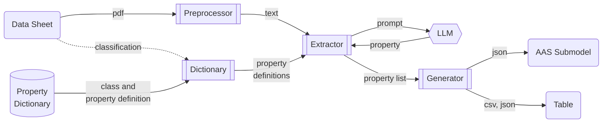
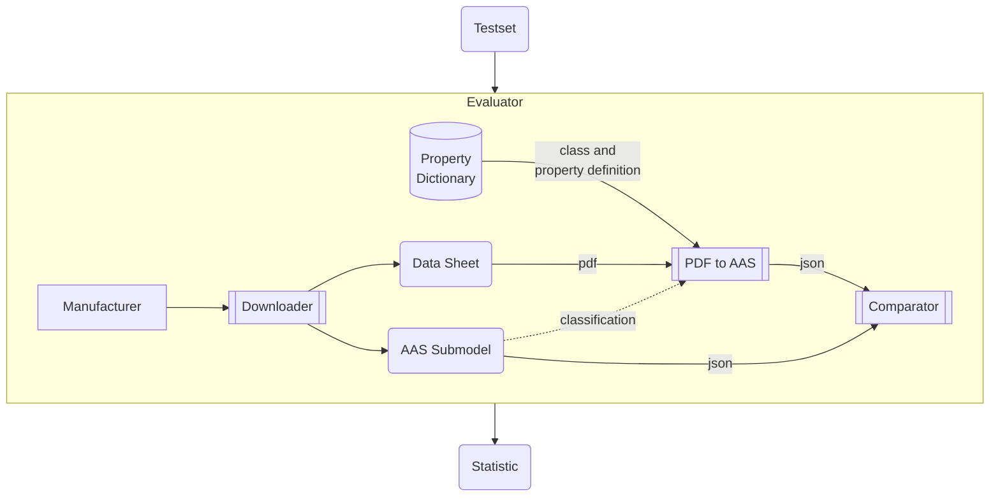

# PDF to AAS

Python libraries and scripts to extract technical data from PDFs utilizing Transformers and especially **Large Language Models (LLMs)** to format them in an **Asset Administration Shell (AAS)** submodel.

## Workflow

Remarks:

* Typical *Property Dictionaries* are ECLASS, CDD, ETIM, EDIBATEC, EPIC, GPC, UniClass
* The *classification* (e.g. ECLASS or ETIM class of the device) will be done manualy first, but can be automated (e.g. also via LLMs) in the future
* Additional *PDF Preprocessors* might be added in the future, e.g. specialized on table or image extraction.
LLMs might also be used to preprocess the PDF content first, e.g. summarize it in JSON format

## Modules

* **preprocessor**: converts the PDF to a text format that can be processed by LLMs, keeping layout and table information.
  * **PDF2HTML**: Uses [pdf2htmlEX](https://github.com/pdf2htmlEX/pdf2htmlEX) to convert the PDF data sheets to HTML.
    The converted html is preprocessed further to reduce token usage for the llms.
* **dictionary**: defines classes and properties semantically.
  * **ECLASS**: downloads property definitions from [ECLASS website](https://eclass.eu/en/eclass-standard/search-content) for a given ECLASS class.
  * **ETIM**: downloads property definitions from [ETIM model releases](https://www.etim-international.com/downloads/?_sft_downloadcategory=model-releases) or via the [ETIM API](https://etimapi.etim-international.com/)
* **extractor**: extracts technical properties from the preprocessed data sheet.
  * **PropertyLLM**: Uses an LLM to search and extract a single property value with its unit from the given text.
* **generator**: transforms an extracted property-value list into different formats.
  * **TechnicalDataSubmodel**: outputs the properties in a [technical data submodel](https://github.com/admin-shell-io/submodel-templates/tree/main/published/Technical_Data/1/2).
  * **CSV**: outputs the properties as csv file

## Tests

* Install `pytest` package, e.g. via `pip install -r requirements.in`
* cd into `pdf2aas`
* Run tests with `python -m pytest`

## Evaluation

To evaluate the extraction process we will use existing manufacturer catalogs, e.g. from WAGO.

