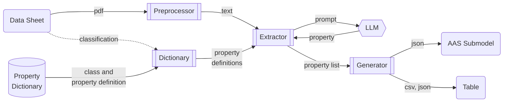
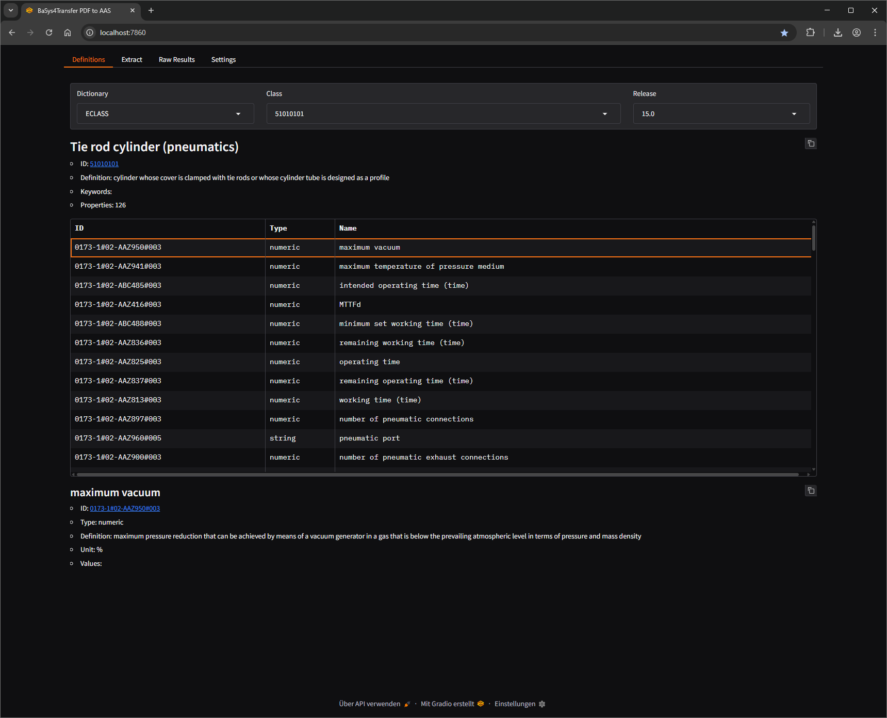
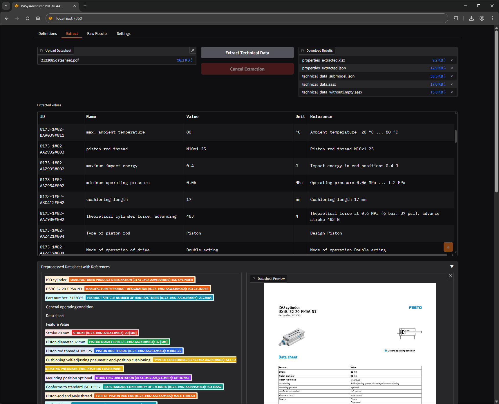
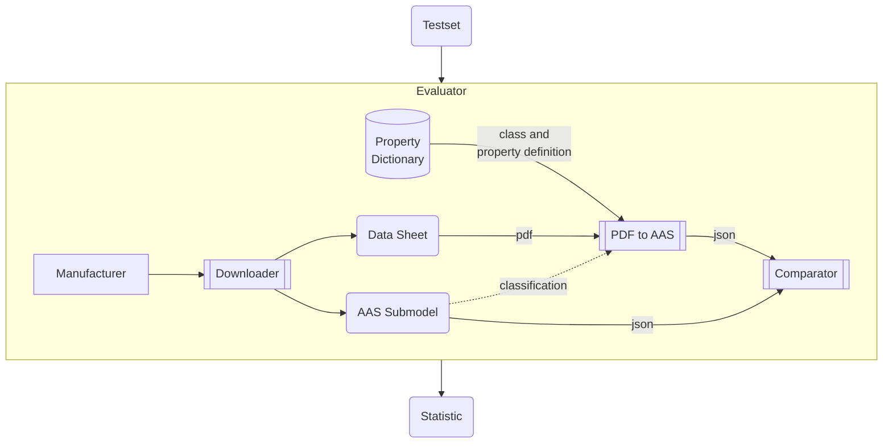

# PDF to AAS

Python libraries and scripts to extract technical data from PDFs utilizing Transformers and especially **Large Language Models (LLMs)** to format them in an **Asset Administration Shell (AAS)** submodel.

## Workflow



Remarks:

* Typical *Property Dictionaries* are ECLASS, CDD, ETIM, EDIBATEC, EPIC, GPC, UniClass
* The *classification* (e.g. ECLASS or ETIM class of the device) will be done manualy first, but can be automated (e.g. also via LLMs) in the future
* Additional *PDF Preprocessors* might be added in the future, e.g. specialized on table or image extraction.
LLMs might also be used to preprocess the PDF content first, e.g. summarize it in JSON format

## Modules

* **preprocessor**: converts the PDF to a text format that can be processed by LLMs, keeping layout and table information.
  * **PDFium**: Uses [pypdfium2](https://github.com/pypdfium2-team/pypdfium2) based on PDFium to extract text from pdf without layout information
  * **PDF2HTML**: Uses [pdf2htmlEX](https://github.com/pdf2htmlEX/pdf2htmlEX) to convert the PDF data sheets to HTML.
    The converted html is preprocessed further to reduce token usage for the llms.
* **dictionary**: defines classes and properties semantically.
  * **ECLASS**: downloads property definitions from [ECLASS website](https://eclass.eu/en/eclass-standard/search-content) for a given ECLASS class.
    * Make sure to comply with [ECLASS license](https://eclass.eu/en/eclass-standard/licenses).
  * **ETIM**: downloads property definitions from [ETIM model releases](https://www.etim-international.com/downloads/?_sft_downloadcategory=model-releases&_sft_language=etim-english&_sft_format=csv&_sft_unit=metric) (CSV version needs to be placed as zip file in `temp/dict`) or via the [ETIM API](https://etimapi.etim-international.com/) (ETIM API client id and secret needs to be provided)
    * Make sure to comply with [ETIM license](https://www.etim-international.com/classification/license-info/), which refers to the [Open Data Commons Attribution License](https://opendatacommons.org/licenses/by/1.0/).
  * **CDD**: downloads property definitions from [IEC CDD website](https://cdd.iec.ch/) for a given CDD class.
    * Make sure to comply with [CDD license](https://cdd.iec.ch/cdd/iec62683/iec62683.nsf/License?openPage). We are only using "FREE ATTRIBUTES" according to the current license.
* **extractor**: extracts technical properties from the preprocessed data sheet.
  * **PropertyLLM**: Uses an LLM to search and extract a single property value with its unit from the given text.
* **generator**: transforms an extracted property-value list into different formats.
  * **TechnicalDataSubmodel**: outputs the properties in a [technical data submodel](https://github.com/admin-shell-io/submodel-templates/tree/main/published/Technical_Data/1/2).
  * **CSV**: outputs the properties as csv file

## Setup

* Create virtual environment (venv) in current directory with `python -m venv .venv`
* Activate venv
  * Windows: `.venv/Scripts/activate`
  * Linux: `source .venv/bin/activate`
* Install requirements
  * if you just want to use the project use `python -m pip install -r requirements.txt`
  * if you want to test it use `python -m pip install -r dev-requirements.txt`
* Install the PDF2AAS package as editable package with `python -m pip install -e .` This makes the package importable in the entire local system while remaining editable.
* For [pdf2htmlEX preprocessor](pdf2aas/preprocessor/pdf2htmlEX.py) the binary needs to be [downloaded](https://github.com/pdf2htmlEX/pdf2htmlEX/wiki/Download) and installed. Currently it is only available for Linux distributions, but it can be used via WSL or Docker on Windows.
* To run the GPT models via the OpenAI API an API key needs to be set as environment variable `OPENAI_API_KEY` or via `.env` file and the `python-dotenv` package.
* To run a local model, the extractor needs to be initialised or configured with an openai API conform api_endpoint.

## Usage

This will save the submodel in json format to the given path, using the default toolchain:

* pypdfium2 preprocessor
* ECLASS dictionary
* OpenAI LLM extractor
* AAS Technical Data Submodel generator

```py
from pdf2aas import PDF2AAS
pdf2aas = PDF2AAS()
pdf2aas.convert('path/to/datasheet.pdf', 'eclass id e.g. 27274001', 'path/to/submodel.json')
```

## Examples

You can find some example toolchains with intermediate steps in the [examples](examples/) folder.
To run them make sure PDF2AAS is installed according to [setup section above](#setup).
Then execute from this directory for example: `python examples/dummy.py`
Use `-h` or `--help` argument for more information on command line arguments.

### Webui

A gradio based web UI is available by starting [examples/demo_gradio.py]().
To use it, additional dependencies need to be installed listed in eval-requirements: `pip install -r eval-requirements.txt`
The webserver is also build as an windows executable, which can be download from the job artifacts: [](https://github.com/JGrothoff/pdf-to-aas/actions/workflows/pyinstaller-demo-gradio-win.yml)

The web UI features the selection of an asset class from ECLASS and ETIM dictionary in different releases.


A datasheet can be uploaded and the properties of the selected dictionary class may be extracted by an LLM.
The extracted properties can be downloaded as xlsx, json, technical data submodel (json) and as an AAS (aasx).


## Tests

[](https://github.com/JGrothoff/pdf-to-aas/actions/workflows/test.yml)

* If not already done, install the dev dependencies via `python -m pip install -r dev-requirements.txt`
* Run tests with `pytest`

## Evaluation

To evaluate the extraction process we will use existing manufacturer catalogs, e.g. from WAGO.


